title: L'imposture du logiciel libre
class: animation-fade
layout: true

---

class: impact

# {{title}}

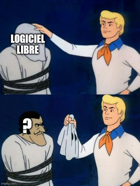

---

## Qui suis-je

- Alexandre Aubin
- Autoradicalisé à 18 ans en regardant les débats de l'assemblée nationale
- Libriste pendant ~10 ans, puis aspirant cyber-anarchiste
- Informaticien dans l'EM de Coopaname, Formateur en informatique en tant qu'ES <small>(Linux/Python)</small>
- Mainteneur du projet [YunoHost](https://yunohost.org/) <small>(distribution Linux pour gérer facilement des services numériques)</small>
- Membre de [Hackstub](https://hackstub.eu/) et [Alsace Réseau Neutre](https://arn-fai.net/) / [Sans-nuage](https://sans-nuage.fr)

.center[
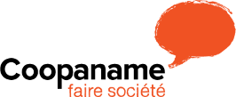
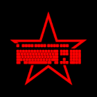

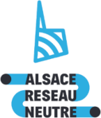
]

---

## Pourquoi cette conf

- Suite de la conf de Vincent
- **Secouer le cocotier consensuel**, coup de gueule contre les « libristes » / le « librisme »
    - pieds dans le plat, carricature à l'emporte-pièce
    - peut-être même utilisation de gros mots comme "libéral", "libertaire", "néo-féodalisme"
    - néanmoins le propos n'est pas de dire qu'il faut arrêter le logiciel libre, mais bien qu'il faut aller au dela
- Je suppose que vous avez une idée générale de ce qu'est le Logiciel Libre et de l'enjeu autour des GAFAM/NATU/BATX
- Initialement adressé aux libristes, mais sans doute des parallèles avec l'ESS, l'écologie, la politique fr, ...

---

## Plan

 

### 1. Qu'est-ce qui est "libre" dans "logiciel libre" ? À qui profite le "libre" ?
 

### 2. La culture libriste est-elle subversive ?

 

### 3. Qu'est-ce qu'on défends *vraiment* ?

---

class: impact

# 1. Qu'est-ce qui est "libre" dans   "logiciel libre" ?

## À qui profite le "libre" ?

---

## L'iceberg du logiciel libre

.center[
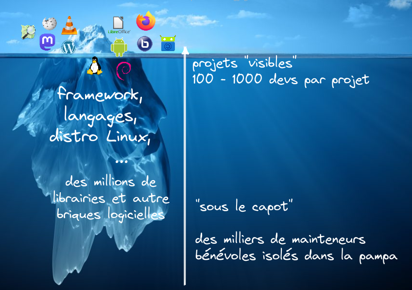
]

---

.center[
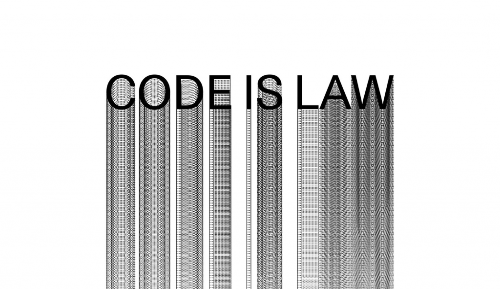
]

---

## Code is law

[Article de Lawrence Lessig](https://www.harvardmagazine.com/2000/01/code-is-law-html)

Le code est juste du texte, jusqu'à ce qu'il détermine le cadre de la vie des ciyoyen·ne·s. À partir de là, le code devient la loi.

- interfaces : "Likes" Facebook, vidéos TikTok, scroll infinis, ...
- bureaucratie : formulaires pole emploi, Odoo, ...
- algorithmes, IA : Cambridge Analytica, voiture autonome, reconnaissance faciale raciste, ... 

---

.center[
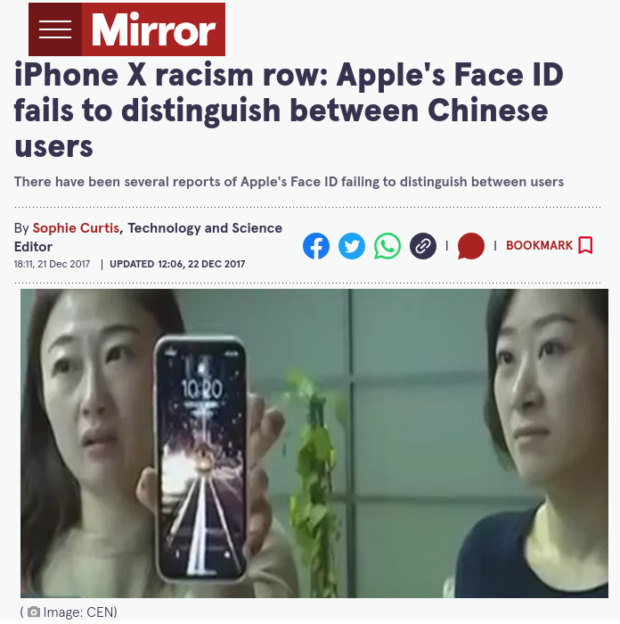
]

---

## Les quatres libertés

 
 

- 0: la liberté d'**exécuter le programme, pour tous les usages** ;
- 1: la liberté d'**étudier le fonctionnement du programme** et de l'adapter à ses besoins ;
- 2: la liberté de **redistribuer des copies** du programme <small>(ce qui implique la possibilité aussi bien de donner que de vendre des copies)</small> ;
- 3: la liberté d'**améliorer le programme et de distribuer ces améliorations** au public, pour en faire profiter toute la communauté.

 
 

.center[
- Émerge dans la candeur des années 1980
- Traduits en "vrai" licences : GPL, MIT, ...
- "Hack juridique"
]

---

.center[
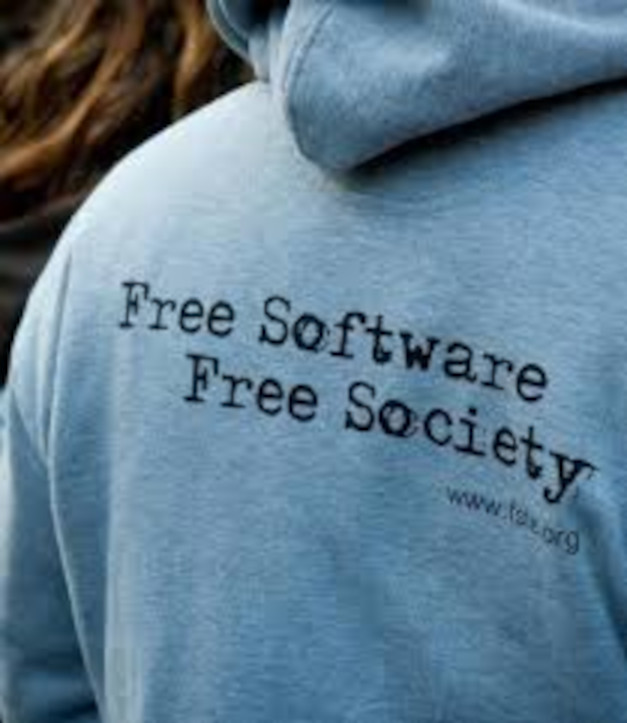
]

---

## Mais ... est-ce que le logiciel libre rends libre ?

- 3 des libertés concernent les développeurs
    - qui a vraiment le temps et les compétences pour lire et modifier du code ?
- La liberté d'utiliser le programme pour tout ... ?
    - aucune interdiction de faire des trucs deguelasses : missiles sous Linux, ...
    - réputation de design discutable : inkscape vs. illustrator, mumble vs. discord, ...
    - réputation d'accessibilité discutable : [Collectif Liberté 0](https://cstrobbe.gitlab.io/Liberte0/index.html)

---

## Bon, tout de même ...

- Transparence
- Développement "indépendant"
- ~Gratuité / ~Pérennité

.center[
   -> Confiance
]

---

## Et aussi : une modalité de production super efficace

- besoin de demander à personne
- pas besoin de réinventer la roue
- des bénévoles prêt·e·s à taffer gratuitement

--

.center[
Devinez qui ça peut intéresser ...?

]
--

.center[
Mais le logiciel libre à tout de même un peu de "germe de communisme"
]

---

## Et c'est ainsi qu'est né ...

.center[
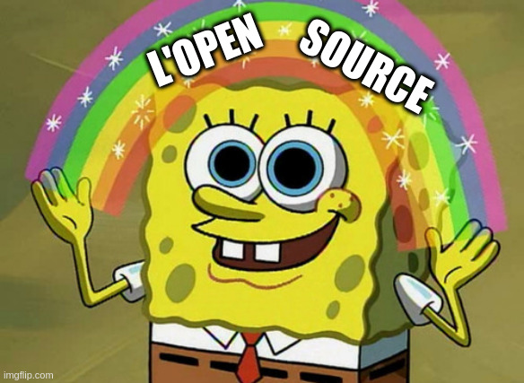
]

---

## L'open source ... ou logiciel libre asseptisé

 

>"Un logiciel libre est un logiciel dont l'utilisation, l'étude, la modification et la duplication par autrui en vue de sa diffusion sont permises, techniquement et juridiquement."

 

>"La désignation open source, [...] possibilités de libre redistribution, d'accès au code source et de création de travaux dérivés."

.center[
**Juridiquement indistinguable**

Et d'ailleurs par abus de language:

Logiciel Libre = Open Source et Vice-versa

Bien que soi-disant, Logiciel Libre = Open Source + "valeurs"
]

---

## Bon mais d'ailleurs, c'est quoi le modele éco ?

.center[
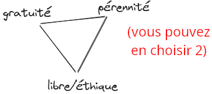
]

--

- **bénévolat complet** / auto-exploitation (applicable seulement aux petits projets, pas très pérenne)

--

- **dons / subventions** (demande pas mal d'énergie, logique "projet")

--

- **fonctionnalités payantes** / open core (pas libres)

--

- **vente de service : support, dev** (les gros payent, ... mais souvent applicable seulement aux gros projets)

--

- **mécénat** (perte d'indépendance)

--

.center[
   **Le libre / open source a besoin des entreprises pour tourner, surtout pour les gros projets**
]

---

## Même Microsoft a fini par kiffer

.center[
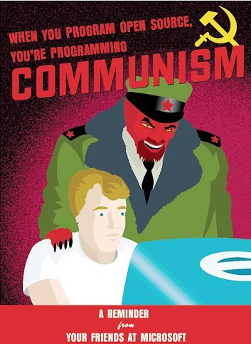
]

---

## Même Microsoft a fini par kiffer

.center[
### 2001

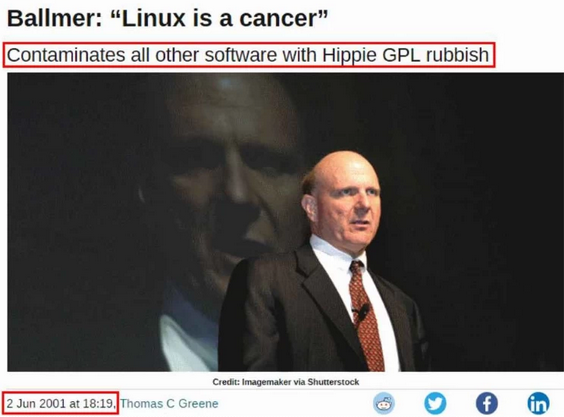
]

---

## Même Microsoft a fini par kiffer

.center[
### 2014

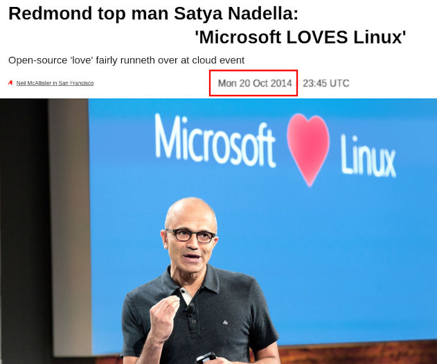
]

---

## 2007 : le tournant

- Premiers smartphones, Android développé par Google (*open source et basé sur Linux!*)
- Montée de Facebook, des plateformes en ligne, du "cloud", *basé sur l'open source* ...

--

.center[
=> émergence du capitalisme de surveillance, hégémonie des GAFAMs

 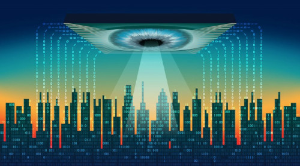
]

--

.center[
**=> changement des règles du jeu : les logiciels ne tournent plus sur vos machines**

**=> peu importe si ils sont libres ou non, ce qui compte c'est qui gère les *données* **
]

---

.center[
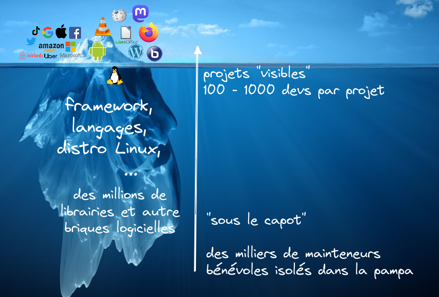
]

---

## On se fait bouffer de partout

- **Google sponsor numéro 1 du FOSDEM** (plus grosse conférence sur le Libre/Open Source en Europe)

.center[
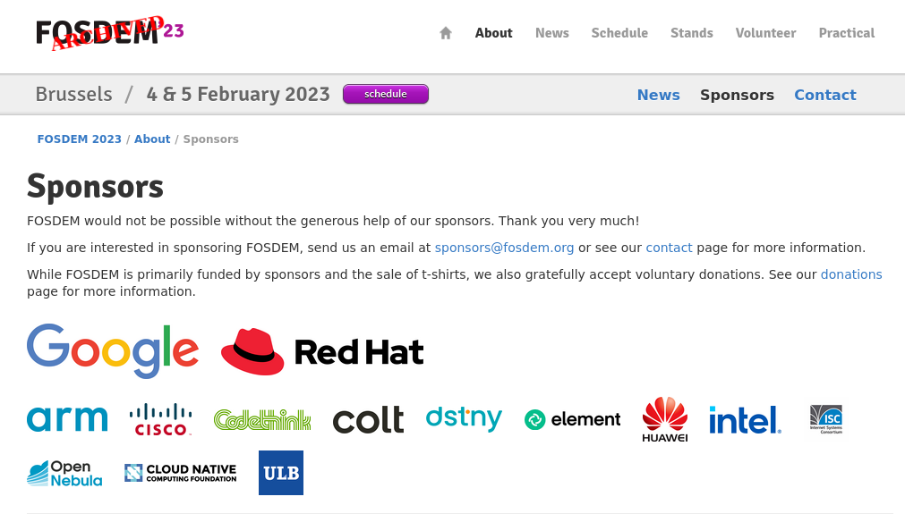
]

---

## On se fait bouffer de partout

- **Google sponsor numéro 1 du FOSDEM** (plus grosse conférence sur le Libre/Open Source en Europe)

- [**Amazon qui abuse de MongoDB sans contribuer en retour**](https://techcrunch.com/2019/01/09/aws-gives-open-source-the-middle-finger/) (et [ici](https://mjtsai.com/blog/2019/01/14/aws-mongodb-and-the-economic-realities-of-open-source/))
   - MongoDB et Elasticsearch qui contre-attaquent en créant [la license SSPL ... pas considérée comme libre](https://en.wikipedia.org/wiki/Server_Side_Public_License)
   - Le libre/open source mis en échec et mat : soit le grand capital profite du travail gratuit, soit il faut restreindre l'usage et c'est plus libre

- **Firefox financé [à 90% par Google](https://fr.wikipedia.org/wiki/Mozilla_Firefox#Partenariats_et_d%C3%A9pendance_%C3%A0_Google) **, **[CEO payée 3 millions](https://en.wikipedia.org/wiki/Mitchell_Baker#Negative_salary-achievements_correlation_controversy)**, choix stratégiques discutables ([1](https://en.wikipedia.org/wiki/Firefox#Firefox_Reality_(AR/VR), [2](https://en.wikipedia.org/wiki/Pocket_(service), [3](https://www.lesnumeriques.com/vie-du-net/faux-virus-vraie-colere-pub-pour-mr-robot-sur-firefox-tourne-mal-n69541.html), ...)
   - Firefox est surtout le moins pire des navigateurs
   - Pourtant il y a un enjeu énorme en terme de "règles de fonctionnement du web"

---

.center[
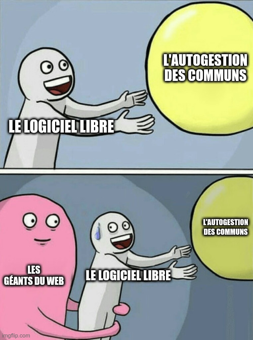
]

---

## Résumé

- **Logiciel libre partout, liberté nulle part**
- Le logiciel libre ne rends pas les gens libre
- Le logiciel libre libère surtout les devs
   - et surtout les devs qui ont de l'argent : la Silicon Valley, les GAFAM/NATU/BATX
- Le logiciel libre a retourné le "copyright" contre lui-même ... 
- ... mais **le grand capital a transformé le Logiciel Libre en Logiciel Libéral** (aka l'Open Source)
- Le logiciel libre (et Internet) sont des pierres angulaires du capitalisme de surveillance

---

.center[

]

---

class: impact

# 2. La culture libriste est-elle subversive ? 

---

## Sociologie des geeks dinolibristes radicaux

--

- Homme blanc cis straight, valide, bien éduqué

--

- Entre-soi **techno-centré, techno-solutionniste, techno-élitiste**, perché dans la technique
    - "tout le monde devrait savoir coder", "les interfaces graphiques c'est nul"
    - font des outils qui marchent pour eux
    - "si t'aimes pas t'as qu'à contribuer"
    - méprise le grand public qui (selon eux) choisi délibérément d'utiliser les GAFAMs
    - "utiliser Microsoft c'est soutenir le fascisme"

--

- **Paumé politiquement**
    - ["la technologie est neutre" versus "code is law"](https://ieeexplore.ieee.org/document/5010049)
    - "liberté absolue" versus paradoxe de la tolérance
    - pas trop de connexions avec les autres luttes
    - à côté de la plaque sur le féminisme et l'inclusivité

--

- **Vision dogmatique et sacralisée du logiciel libre**
    - confusion entre finalité et moyen
    - 100% de libre partout, quitte à être excluant
    - vision binaire "soit c'est libre soit c'est proprio"

---

## Sociologie des geeks dinolibristes radicaux

- Homme blanc cis straight, valide, bien éduqué
- Entre-soi **techno-centré, techno-solutionniste, techno-élitiste**, perché dans la technique
- **Paumé politiquement**
- **Vision dogmatique et sacralisée du logiciel libre**
- Fait l'autruche sur l'équation libre, gratuit, et nécessité de manger
- Fait l'autruche sur [la réalité du logiciel libre à l'ère du cloud et du mobile](https://mjtsai.com/blog/2019/10/21/fsf-missed-the-cloud-and-mobile/)

---

 
 
 
 
 
 

.center[
## Exemple :   le librisme radical dans le collectif CHATONS
]

---

## Les CHATONS : les AMAP du numérique

.center[

### 2014 -> 2017 : Campagne "dégooglisons internet" de Framasoft

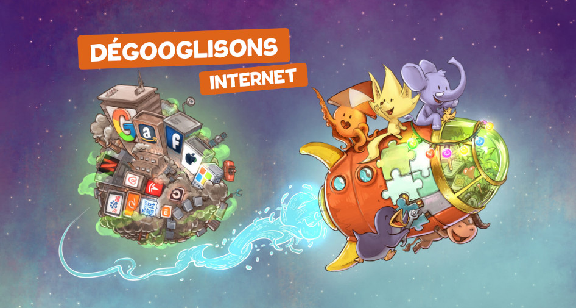
]

---

## Les CHATONS : les AMAP du numérique

.center[

### 2014 -> 2017 : Campagne "dégooglisons internet" de Framasoft

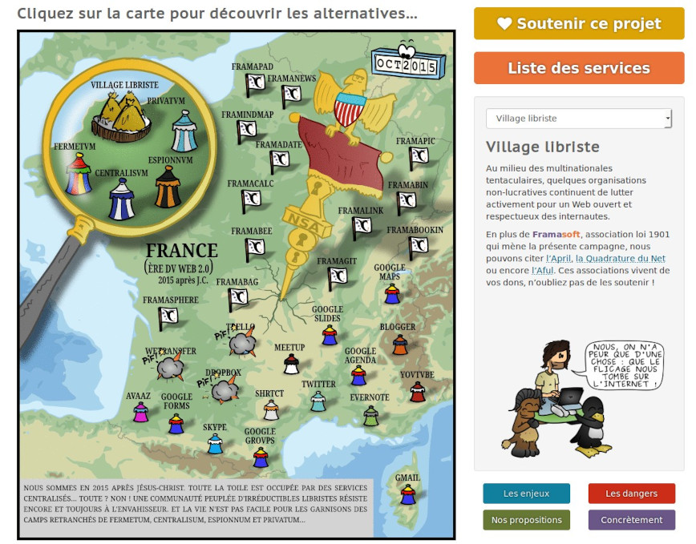
]

---

## Les CHATONS : les AMAP du numérique

.center[
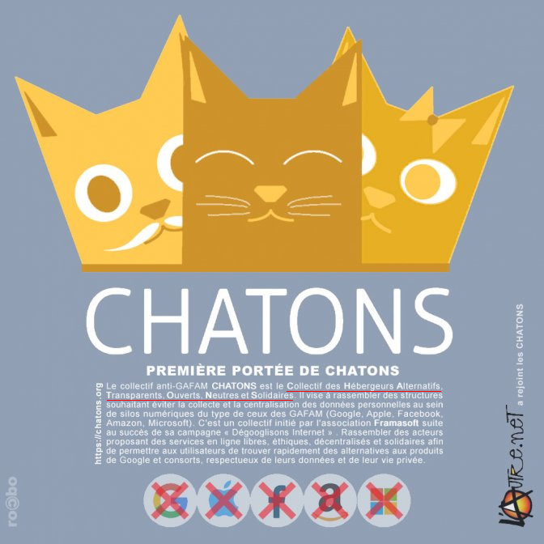
]

---

## Les CHATONS : les AMAP du numérique

- **Charte qui demande 100% de libre** : intenable, ambigue, pleins de zones grises
    - proxy pour services centralisés/privateurs
    - ponts Matrix<->Whatsapp
    - logo fait avec Adobe Illustrator
    - ...

--

- **Charte excluante** -> [proposition d'adapter la charte](https://forum.chatons.org/t/faut-il-des-exceptions-pour-la-clause-100-libre/5015) pour affirmer plutôt un "idéal qu'il faut chercher à atteindre" et prendre acte des zones grises

--

- Schisme
    - **Librisme radical**: 100% de libre quoi qu'il en coûte, quitte à exclure des collectifs, des personnes, des usages
    - **Informatique émancipatrice**: Logiciel libre ni suffisant, ni nécessaire(?), à équilibrer avec le pragmastisme et la finalité

--

.center[
### Les gens viennent-ils dans les CHATONS pour avoir 100% de libre, ou bien une informatique décentralisée, bienveillante, loyale, solidaire, conviviale, émancipatrice, ... ?
]

---

 
 
 
 
 
 

.center[
## Autre exemple :   la licence « Coopyleft » de Coopcycle
]

---

## Autre exemple: la licence Coopyleft

- **Coopcycle**: Coopérative de livreur·euse·s
- Développe un logiciel (plateforme+app) "[CoopCycle](https://coopcycle.org/fr/logiciel/)"
- ... mais et si le grand capital néolibéral utilise cet outil sans rien en retour !?
- Choix de limiter l'usage commercial aux entreprises coopératives avec une nouvelle license [Coopyleft](https://blogs.mediapart.fr/coopcycle/blog/170418/comment-proteger-le-logiciel-ouvert-coopcycle-de-la-predation-capitaliste) (pas libre !)

.center[
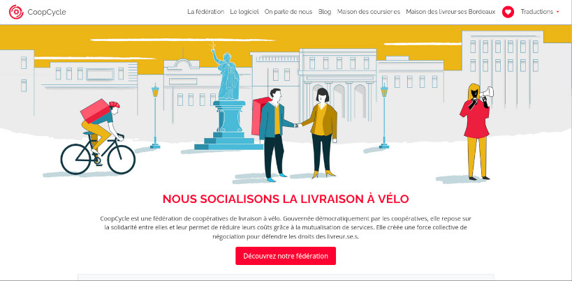
]

---

## Plus généralement

### Comment casser le mécanisme où les communs nourissent le capital ? Imposer une réciprocité ? Séparer les deux ?

[Post open-source](https://www.boringcactus.com/2020/08/13/post-open-source.html), [Copyfarleft](https://wiki.p2pfoundation.net/Copyfarleft), licenses à réciprocité

- [Creative Common "sans utilisation commerciale"](https://creativecommons.org/2016/09/09/why-were-fighting-to-protect-noncommercial-uses/)
- [Licence Coopyleft](https://wiki.coopcycle.org/en:license) -> droit d'utilisation réservé aux coopératives
- [Licence Anti-Capitaliste](https://anticapitalist.software/) -> droit d'utilisation, sauf pour le capital
- [Licence Hyppocratic](https://firstdonoharm.dev/) -> interdire les trucs déguelasses : atteintes aux droits de l'homme, écocides, exploitation des travailleur·euse·s, ...
- [Licence Non-violente (NPL)](https://thufie.lain.haus/NPL.html) et CNPL
- [Licenses à réciprocité](https://scinfolex.com/2014/09/22/comprendre-le-principe-des-licences-a-reciprocite-en-5-minutes/)
    - [Peer Production License](https://scinfolex.com/2012/11/10/peer-production-licence-une-licence-concue-pour-les-biens-communs/) -> commercialisation possible seulement en échange d'une contribution financière
    - CopyFair

.center[
### NB : rien de tout ça n'est "libre" (au sens classique)
### => libristes pas content
]

---

class: impact

# 3. Qu'est-ce qu'on défends *vraiment* ?

---

## Qu'est-ce qu'on défends vraiment ?

### Tentative de cartographie des luttes "cyber" (1/2)

.center[
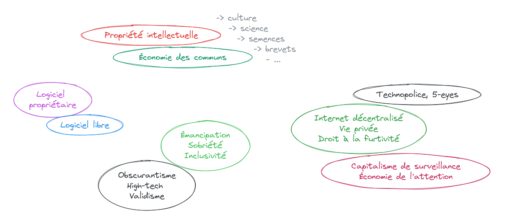
]

---

## Qu'est-ce qu'on défends vraiment ?

### Tentative de cartographie des luttes "cyber" (2/2)

.center[
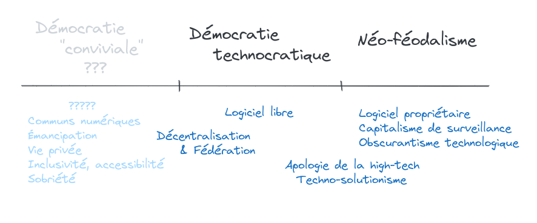
]

---

## Qu'est-ce qu'on défends vraiment ?

### Le logiciel libre ... une modalité de la lutte cyber-libertaire ?

- Techno-critique, valeurs libertaires
- Combattre les rapports de domination véhiculés par la technologie
    - Le logiciel libre est une technocratie
- Télé-communisme, cyber-anarchisme ?

.center[

]

---

class: impact

# 4. Conclusions

---

- **Le logiciel libre = lutte obsolète**, phagocitée par les GAFAM/NATU/BATX -> c'est le status quo
    - ni une fin en soi, ni suffisant, ni nécessaire -> faire le deuil

--

- **Reconnaître le problème est systémique** et dépasse grandement le cadre du juridico-technique
    - on se fait bouffer par l'ED, le néolibéralisme, la technopolice, la crise climatique
    - il est grand temps que les "libristes" convergent avec les autres luttes

--

- **Nécessité d'expliciter les "valeurs", de définir un nouveau "référentiel"**
    - quels principes pour un numérique convivial, inclusif, loyal, en commun, sobre, féministe, libertaire ?
    - commment faire autre chose que du logiciel libéral ? organiser le travail et sa rémunération, arrêter de s'auto-exploiter tout en nourissant le capitalisme ? Comment imposer une réciprocité ?

--

- **Refusons la technocratie, le techno-élitisme et la pureté militante *dès maintenant* **
    - vous devriez contrôler les outils et les développeur·euse·s, pas l'inverse (anecdote Valérie)
    - vous n'êtes pas "nul.le en informatique", c'est la *machine* qui n'est pas ergonomique
    - on peut utiliser Google mais se battre pour un numérique libertaire, sans s'auto-flagéller... *précisément* parce que s'extraire de l'hégémonie est *réalistiquement impossible*
    - demandez des alternatives qui *fonctionnent*, même pour les non-geeks

--

- **À quand des services publics des communs numériques en opposition à la startup-nation ?**

---

## Références

- [Conférence gesticulée : Informatique ou libertés ?](https://informatique-ou-libertes.fr/)
- [Les Communs numériques sont-il condamnés à devenir des « Communs du capital » ?](https://scinfolex.com/2018/06/24/les-communs-numeriques-sont-il-condamnes-a-devenir-des-communs-du-capital/)
- [Peut-on faire du libre sans vision politique ?](https://www.canalc2.tv/video/15197)
- [Low tech : face au tout-numérique, se réapproprier les technologies](https://www.ritimo.org/Low-tech-face-au-tout-numerique-se-reapproprier-les-technologies-8264)
- [Pas de sexisme chez les Libristes ?](https://framablog.org/2013/05/24/pas-de-sexisme-chez-les-libristes/)
- [Logiciel libre et anarchisme](https://framablog.org/2023/10/09/logiciel-libre-et-anarchisme/)
- [The Telekommunist Manifesto](https://media.telekommunisten.net/manifesto.pdf)
- [Le logiciel libre : simple, basique](https://bzg.fr/le-logiciel-libre-simple-basique/)
- [Forum CHATONS - Faut-il des exceptions à la clause 100% libre ?](https://forum.chatons.org/t/faut-il-des-exceptions-pour-la-clause-100-libre/5015) et aussi [celui-ci](https://forum.chatons.org/t/que-vous-soyez-dans-le-brouillard-ou-profondement-contre-le-texte-au-vote/5162) et aussi [ce pad](https://pad.sans-nuage.fr/p/whishlist-exceptions)
- [Compte-rendu du Forum ouvert « Faut-il en finir avec le Libre ? »](https://dérivation.fr/compte-rendu-du-forum-ouvert-faut-il-en-finir-avec-le-libre/)
- [Technoféminisme - Comment le numérique aggrave les inégalités](https://www.grasset.fr/livre/technofeminisme-9782246828822/)
- [Dépasser le fonctionnement en silo, la "tragédie du LSD, Libre, Solidaire et Durable"](http://www.cooperations.infini.fr/spip.php?article11428)
- [Outil convivial](https://fr.wikipedia.org/wiki/Outil_convivial)
- [Manifest Cyborg](https://fr.wikipedia.org/wiki/Manifeste_cyborg)
- [Post Open-Source](https://www.boringcactus.com/2020/08/13/post-open-source.html)
- [Licence anti-capitaliste](https://anticapitalist.software/acsl_french)
- [Technopolice](https://technopolice.fr/)

